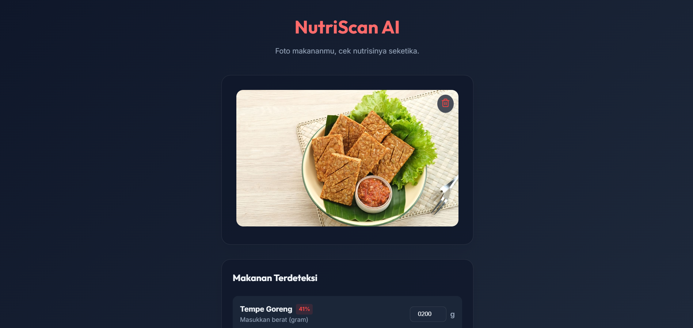
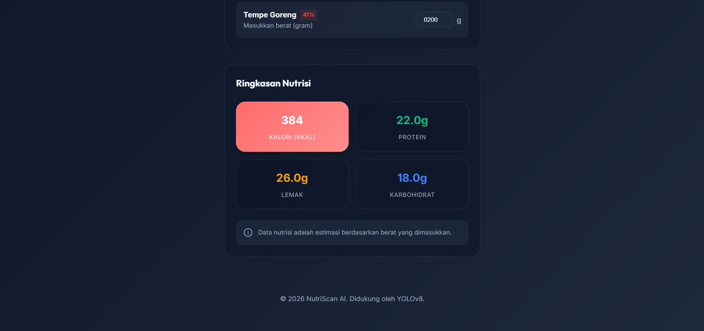

# 🥗 NutriScan AI - Food Nutrition Web App

NutriScan AI adalah aplikasi web cerdas yang memungkinkan pengguna untuk mendeteksi jenis makanan melalui foto dan menghitung total nutrisinya secara real-time. Proyek ini menggabungkan kekuatan **YOLOv8** untuk deteksi objek (makanan) dan **FastAPI** sebagai backend untuk pengolahan data nutrisi.

## 📸 Pratinjau Antarmuka


*Tampilan Utama Deteksi Makanan*


*Hasil Ringkasan Nutrisi Lengkap*

## ✨ Fitur Utama

-   **📸 Deteksi Makanan via Kamera/Unggah**: Ambil foto makanan langsung atau unggah dari galeri.
-   **🤖 Kecerdasan Buatan (AI)**: Mendeteksi 21+ jenis makanan Indonesia menggunakan model YOLOv8.
-   **⚖️ Input Berat Kustom**: Masukkan berat makanan dalam satuan gram untuk akurasi perhitungan.
-   **📊 Dashboard Nutrisi Real-time**: Menampilkan total Kalori, Protein, Lemak, dan Karbohidrat secara instan.
-   **📱 Desain Premium & Responsif**: Antarmuka modern dengan gaya *Glassmorphism* yang ramah perangkat mobile.

## 🛠️ Teknologi yang Digunakan

-   **Frontend**: [React.js](https://reactjs.org/) + [Vite](https://vitejs.dev/) + [Vanilla CSS](https://developer.mozilla.org/en-US/docs/Web/CSS)
-   **Backend**: [FastAPI](https://fastapi.tiangolo.com/) (Python)
-   **AI Model**: [YOLOv8](https://ultralytics.com/yolov8) (Ultralytics)
-   **Komunikasi API**: Axios
-   **Tunneling**: LocalTunnel (untuk akses dari Colab)

## 🚀 Cara Menjalankan Proyek

### 1. Persiapan Backend (Google Colab)
1.  Buka notebook Colab Anda yang berisi model YOLOv8.
2.  Instal dependensi: `pip install fastapi uvicorn python-multipart nest-asyncio ultralytics`.
3.  Jalankan server FastAPI dan tunnel LocalTunnel untuk mendapatkan URL publik.

### 2. Persiapan Frontend
1.  Masuk ke direktori frontend:
    ```bash
    cd frontend
    ```
2.  Instal dependensi:
    ```bash
    npm install
    ```
3.  Buka file `src/App.jsx` dan ganti `API_BASE_URL` dengan URL LocalTunnel Anda.
4.  Jalankan aplikasi:
    ```bash
    npm run dev
    ```

## 📝 Catatan Penting
Aplikasi ini menggunakan infrastruktur LocalTunnel. Jika Anda mengalami error CORS, pastikan untuk membuka URL backend sekali di tab baru dan klik **"Click to Continue"** untuk memberikan izin akses.

---
&copy; 2026 NutriScan AI Team. 
